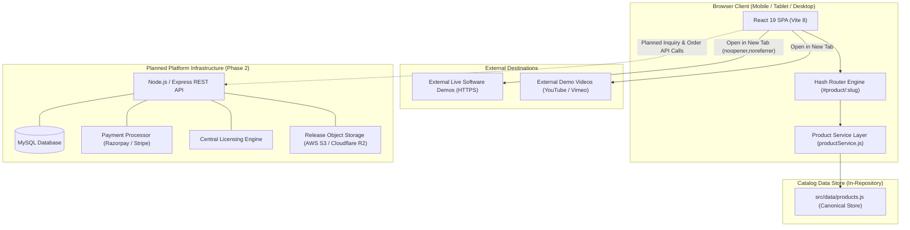

# Kiaan Marketplace — System Architecture

**Version:** 1.1  
**Date:** 2026-09-28  
**Status:** Authoritative Architecture Document — Verified against active codebase  
**Product:** Kiaan Marketplace  
**Owner:** Kiaan Technology Pvt Ltd  
**Repository:** Single-vendor showcase storefront (`d:\KIAAN\Kiaan MarketPlace`)

---

## Contents

1. [System Context Diagram](#1-system-context-diagram)
2. [Verified Technology Stack](#2-verified-technology-stack)
3. [Frontend Component Architecture & Responsibilities](#3-frontend-component-architecture--responsibilities)
4. [Product Data Contract (`src/data/products.js`)](#4-product-data-contract)
5. [Target Platform Boundaries (Planned)](#5-target-platform-boundaries-planned)
6. [Security & Tab Isolation Architecture](#6-security--tab-isolation-architecture)
7. [Build & Production Packaging](#7-build--production-packaging)
8. [Architecture Audit & Verification Findings](#8-architecture-audit--verification-findings)

---

## 1. System Context Diagram

Kiaan Marketplace is architected as a **modular Single-Page Application (SPA)** built with React 19 and Vite. The current repository contains the complete public showcase layer. Planned backend and platform services connect through clearly defined API boundaries.



---

## 2. Verified Technology Stack

| Layer | Technology | Version | Location / Details | Status |
| :--- | :--- | :--- | :--- | :--- |
| **Framework** | React | `^19.2.8` | `package.json` | **Active & Verified** |
| **DOM Renderer** | React-DOM | `^19.2.8` | `package.json` | **Active & Verified** |
| **Bundler & Dev Server** | Vite | `^8.3.0` | `vite.config.js` | **Active & Verified** |
| **Icons** | Lucide React | `^1.48.0` | `node_modules/lucide-react` | **Active & Verified** |
| **Styling Tokens** | Vanilla CSS | Custom | `src/index.css` (Warm Authority theme) | **Active & Verified** |
| **CSS Processing** | Tailwind CSS DevPlugin | `^4.3.3` | `@tailwindcss/vite` (Dev utility) | **Active & Verified** |
| **Linter** | Oxlint | `^1.81.0` | `.oxlintrc.json` | **Active & Verified** |
| **Data Storage (Current)** | Centralized JS Store | ES6 Modules | `src/data/products.js` | **Active & Verified** |
| **Backend API** | Node.js / Express | TBD | Not present in current frontend repo | **Planned (Phase 2)** |
| **Database** | MySQL | TBD | Not present in current frontend repo | **Planned (Phase 2)** |
| **Payment Gateway** | Razorpay / Stripe | TBD | Webhook signature verification | **Planned (Phase 2)** |
| **Object Storage** | S3 / Cloudflare R2 | TBD | Software binary release distribution | **Planned (Phase 2)** |

---

## 3. Frontend Component Architecture & Responsibilities

```
src/
├── main.jsx                     # Application bootstrap mounting into index.html
├── App.jsx                      # Primary app orchestrator, hash-based router, view coordinator
├── index.css                    # Central design system, CSS variables, and layout utilities
├── App.css                      # Application-level structural styling
├── data/
│   ├── products.js              # Canonical centralized software catalog
│   └── marketplaceData.js       # Complementary presentation metadata
├── services/
│   └── productService.js        # Data query service (getPublishedProducts, getProductBySlug, etc.)
└── components/
    ├── Header.jsx               # Sticky top navigation, branding, search jump, category dropdown
    ├── Hero.jsx                 # Value proposition, keyword search input, explore CTA
    ├── CategoryNav.jsx          # Interactive category filter pill list
    ├── FeaturedSoftware.jsx     # Flagship spotlight, catalog search/filter, software cards
    ├── IndustrySolutions.jsx    # Tailored industry software cards (Manufacturing, Retail, etc.)
    ├── WhyKiaan.jsx             # Company strengths, deployment assistance, security commitment
    ├── HowItWorks.jsx           # 4-step buyer evaluation journey
    ├── CustomizationServices.jsx# Bespoke development offering cards
    ├── FaqSection.jsx           # Expandable accordion for common buyer questions
    ├── Footer.jsx               # Deep charcoal footer, legal disclaimers, company info
    ├── ProductDetailPage.jsx    # Comprehensive product page (gallery, tabs, demo CTA, specs)
    ├── CustomQuoteModal.jsx     # Inquiry modal form with client validation & feedback
    ├── LiveDemoModal.jsx        # Walkthrough modal utility
    ├── ProductDetailModal.jsx   # Quick-view modal utility
    ├── SoftwarePreviewMock.jsx  # Interface preview renderer
    ├── SupportLicensing.jsx     # License policy information card
    └── admin/
        └── AdminPanel.jsx       # Isolated component; NOT mounted or exposed in public routes
```

### Component Responsibility Matrix

| Component | Responsibility |
| :--- | :--- |
| `App.jsx` | Manages root view state (`'home'` vs `'product-detail'`), listens to `hashchange` events, coordinates active product slug, and opens `CustomQuoteModal`. |
| `Header.jsx` | Fixed header with Kiaan logo, category dropdown menu, keyboard search trigger (`Ctrl+K`), and navigation links. |
| `FeaturedSoftware.jsx` | Displays flagship spotlight and responsive grid of software cards. Handles real-time search queries and category filters. Renders "Live Demo" button for valid URLs or "Demo Coming Soon" badge when `demoUrl` is empty. |
| `ProductDetailPage.jsx` | Detailed software specifications divided into 4 tabs: Overview, Features, Modules, and Technical Information. Contains screenshot gallery with active preview switcher, safe external demo launch button, and quote trigger. |
| `CustomQuoteModal.jsx` | Controlled modal dialog prefilled with product or customization service title. Validates user input and provides submission feedback. |
| `productService.js` | Abstracts product data access with methods: `getAllProducts()`, `getPublishedProducts()`, `getFeaturedProducts()`, `getProductBySlug(slug)`, `getProductById(id)`, and `getProductsByCategory(categoryId)`. |

---

## 4. Product Data Contract

All software product records in `src/data/products.js` conform to the following contract:

```javascript
{
  id: String,                      // Unique identifier (e.g. 'kiaan-erp-enterprise')
  slug: String,                    // URL-safe route slug (e.g. 'kiaan-erp-enterprise')
  name: String,                    // Official product name (e.g. 'KiaanERP Enterprise')
  category: String,                // Full category label (e.g. 'Enterprise Resource Planning')
  categoryId: String,              // Category lookup code ('erp' | 'crm' | 'hrms' | 'inventory' | 'pos' | 'automation')
  shortDesc: String,               // Plain-language 1-2 sentence card summary
  fullDesc: String,                // In-depth multi-paragraph software description
  
  // Demo & Walkthrough Configuration
  demoUrl: String,                 // Real external HTTPS URL (e.g. 'https://erp.kiaantechnology.com'). Leave as '' if pending.
  demoVideoUrl: String,            // Walkthrough video URL (YouTube, Vimeo, MP4). Leave as '' if pending.
  
  // Media Assets
  screenshots: [                   // Array of interface screenshot objects
    { url: String, caption: String }
  ],
  
  // Capabilities & Functional Scope
  features: [ String ],            // Plain-English bullet points of verified capabilities
  modules: [ String ],             // List of integrated functional modules
  whoShouldUse: String,            // Target enterprise profile and industry fit
  techStack: String,               // Supported deployment targets (Linux, Docker, AWS, Node, MySQL)
  
  // Commercial & Licensing Parameters
  pricing: {
    isApproved: Boolean,           // Set to false until commercial pricing is formally approved
    priceDisplay: String,          // 'Contact for Pricing' (or approved currency figure)
    pricingNote: String            // License scope description (e.g. 'Perpetual single-domain license')
  },
  customizationAvailable: Boolean, // Indicates custom feature adaptation availability
  isFlagship: Boolean,             // Highlights software in spotlight banner
  isFeatured: Boolean              // Displays software in featured catalog
}
```

---

## 5. Target Platform Boundaries (Planned)

When the platform backend is implemented in Phase 2, responsibilities are partitioned as follows:

```
┌─────────────────────────────────┐       ┌─────────────────────────────────┐
│       PUBLIC FRONTEND (SPA)     │       │       BACKEND API (REST)        │
│                                 │       │                                 │
│ • Catalog browsing & filtering  │       │ • Authoritative order state     │
│ • External demo launching       │       │ • Webhook signature verification│
│ • Client-side form validation   │ ────► │ • User authentication & RBAC    │
│ • Hash-based routing            │       │ • License key & token signing   │
│ • Presentation state            │       │ • Presigned download URL issuer │
│                                 │       │ • Audit log recording           │
└─────────────────────────────────┘       └─────────────────────────────────┘
```

1. **Client Never Determines Entitlement:** The frontend never decides whether a license is valid or whether a payment succeeded.
2. **Server-Held Secrets:** Private cryptographic keys for signing license tokens reside exclusively on Kiaan backend servers.
3. **Download Protection:** Software binaries are stored in private cloud buckets; downloads are served only via short-lived (15-minute) presigned URLs generated for authenticated customers.

---

## 6. Security & Tab Isolation Architecture

1. **Tab Isolation on External Demo Links:**  
   Every demo button and link leading to an external domain implements:
   ```html
   <a href={demoUrl} target="_blank" rel="noopener noreferrer">
   ```
   This prevents the target page from accessing `window.opener` and protects visitors against reverse-tabnabbing exploits.
2. **Zero Bundled Secrets:**  
   Vite client builds contain zero sensitive environment variables. No payment gateway private keys, database passwords, or administrative tokens exist in frontend code.
3. **No Localhost Links:**  
   The application logic explicitly rejects localhost URLs in production mode, guaranteeing that no developer machine is inadvertently referenced.

---

## 7. Build & Production Packaging

The frontend is compiled into a lightweight static bundle via Vite:
- **Build Command:** `npm run build`
- **Output Directory:** `dist/`
- **Performance Characteristics:**
  - HTML entry point: `dist/index.html` (~1.23 KB)
  - CSS stylesheet: `dist/assets/index-*.css` (~13.3 KB, ~3.6 KB gzip)
  - JavaScript bundle: `dist/assets/index-*.js` (~423 KB, ~108 KB gzip)
- **Deployment Compatibility:** Deployable to any static host (Cloudflare Pages, AWS S3 + CloudFront, Vercel, Netlify, or Nginx).

---

## 8. Architecture Audit & Verification Findings

Based on comprehensive inspection of the workspace (`d:\KIAAN\Kiaan MarketPlace`), the architectural state is documented below:

| Architectural Question | Verified Reality in Repository | Action / Note |
| :--- | :--- | :--- |
| **Does a backend exist in this repo?** | **No.** Only the Vite + React frontend is present. | Backend API development is scheduled for Phase 2. |
| **Is MySQL connected?** | **No.** No database drivers, ORMs, or connection configs exist. | Database will accompany the Node.js backend. |
| **How is product data managed?** | **Centralized in `src/data/products.js`.** | Single maintainable source of truth for all products. |
| **What routing is used?** | **Client-side hash routing (`#product/:slug`).** | Native window hash synchronization in `App.jsx`. |
| **Is an Admin Panel exposed?** | **No.** `AdminPanel.jsx` is completely unmounted. | Preserves single-vendor public showcase rule. |
| **Where do demos lead?** | **External HTTPS URLs.** Empty links show "Demo Coming Soon". | Verified in `FeaturedSoftware.jsx` and `ProductDetailPage.jsx`. |
| **Where do quote inquiries go?** | **Handled in frontend modal (`CustomQuoteModal.jsx`).** | Pending backend submission webhook or email handler. |
| **Are build checks passing?** | **Yes.** `npm run build` exits with code 0 in ~2 seconds. | Verified production bundle stability. |

