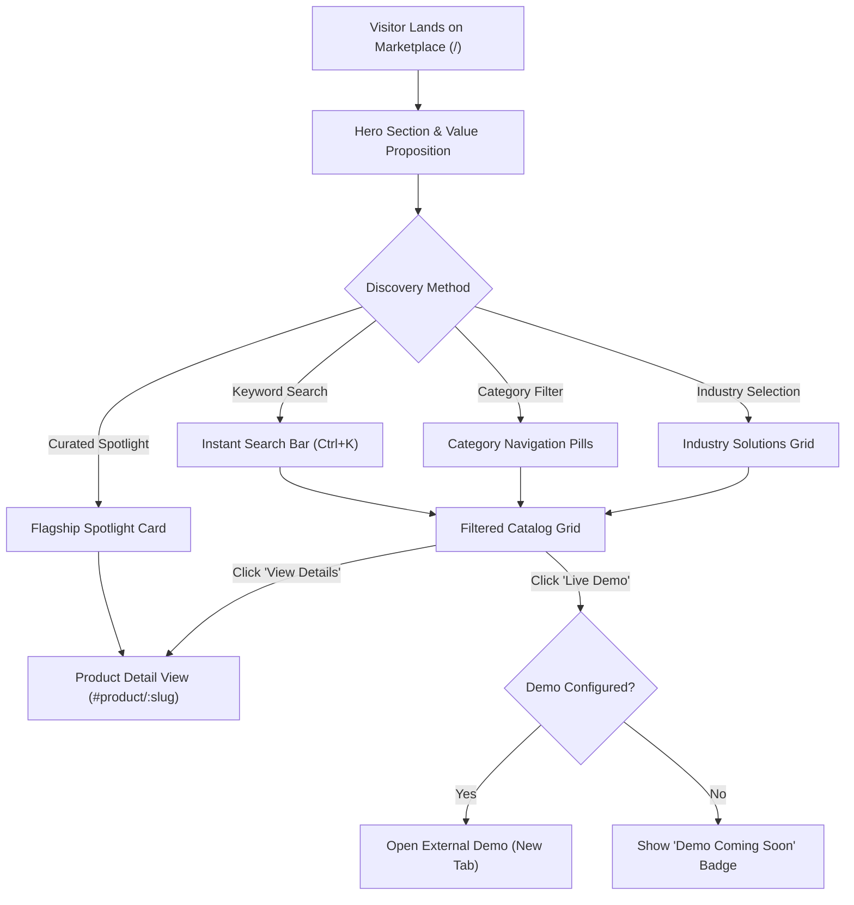
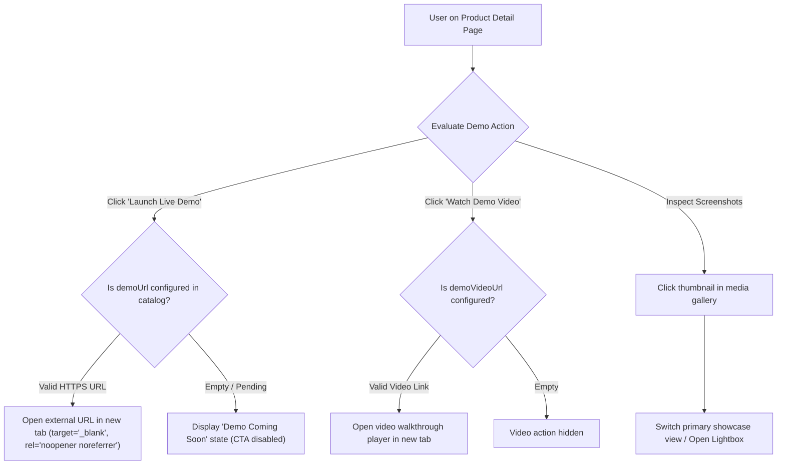
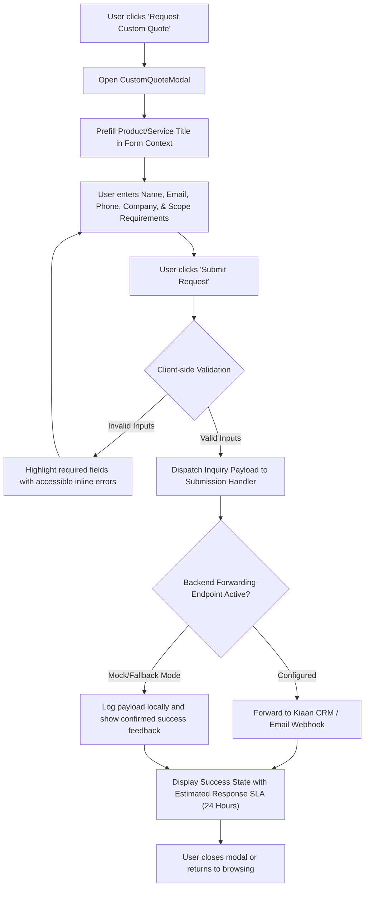
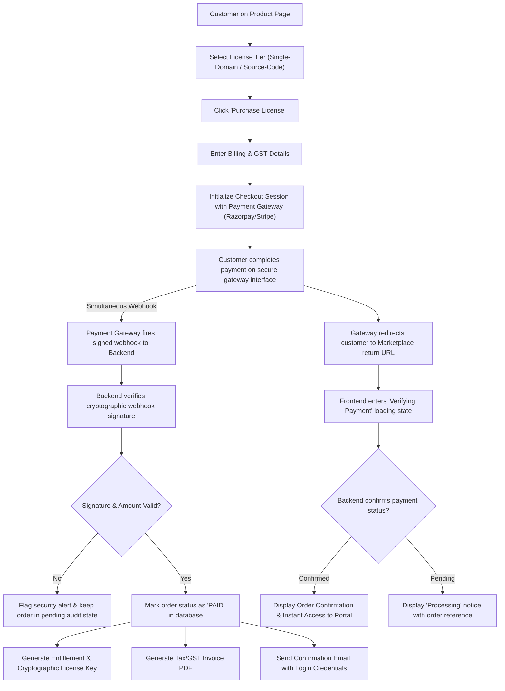
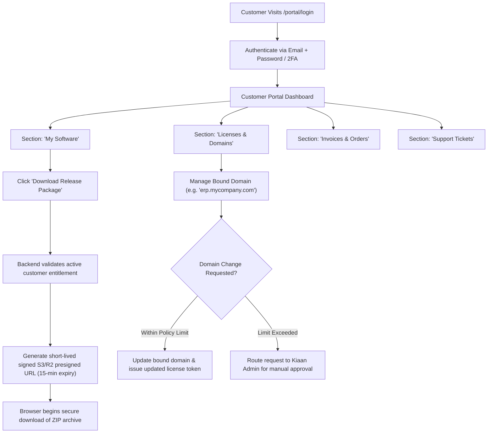
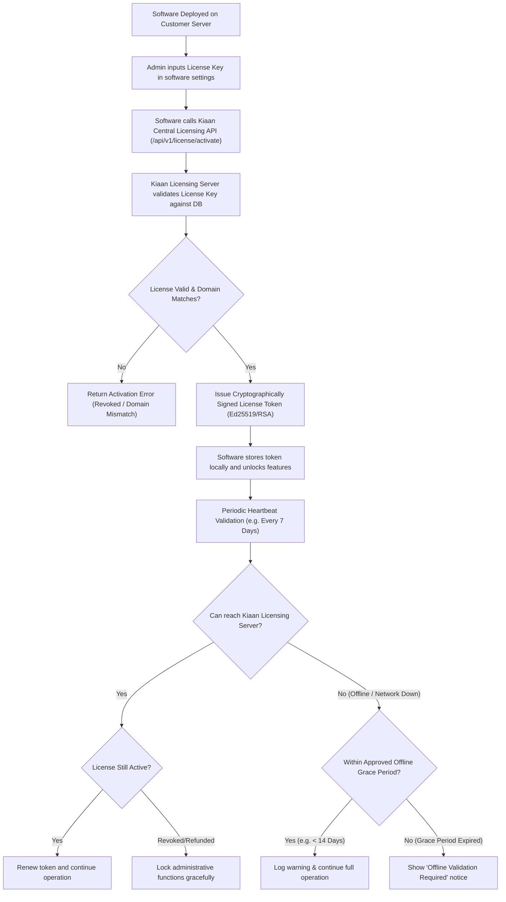
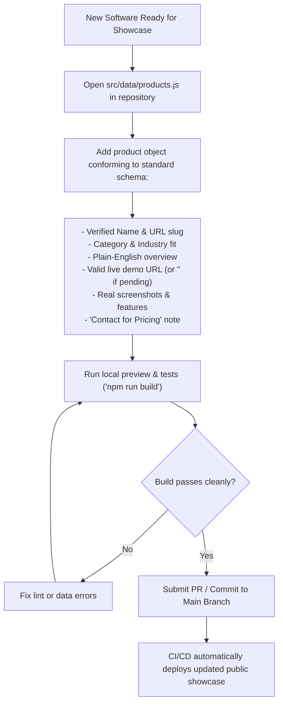

# Kiaan Marketplace — User Flows

**Version:** 1.1  
**Date:** 2026-09-28  
**Status:** Authoritative Source of Truth — Approved Working Baseline  
**Product:** Kiaan Marketplace  
**Owner:** Kiaan Technology Pvt Ltd  

---

## Contents

1. [Flow 1: Visitor Discovery & Search (Implemented)](#1-visitor-discovery--search-implemented)
2. [Flow 2: Live Demo & Video Evaluation (Implemented)](#2-live-demo--video-evaluation-implemented)
3. [Flow 3: Customization Inquiry & Quote Request (Frontend Implemented)](#3-customization-inquiry--quote-request-frontend-implemented)
4. [Flow 4: Software Purchase & Order Fulfillment (Planned)](#4-software-purchase--order-fulfillment-planned)
5. [Flow 5: Customer Portal & Asset Access (Planned)](#5-customer-portal--asset-access-planned)
6. [Flow 6: Central License Lifecycle & Domain Validation (Planned)](#6-central-license-lifecycle--domain-validation-planned)
7. [Flow 7: Internal Product Operations & Catalog Updates (Operational)](#7-internal-product-operations--catalog-updates-operational)
8. [Flow 8: Shared Edge Cases & System Exception States](#8-shared-edge-cases--system-exception-states)

---

## 1. Visitor Discovery & Search (Implemented)

**Implementation Status:** `ALREADY IMPLEMENTED & VERIFIED` in React 19 frontend.  
**Primary Actor:** Business visitor / Enterprise buyer  
**Trigger:** Visitor lands on `https://marketplace.kiaantechnology.com/` (or root route `/`).  
**Success Outcome:** Visitor finds an appropriate Kiaan software product and navigates to its dedicated detail view (`#product/:slug`).

### Flow Notes:
- Search queries filter title, category, and feature tags instantly without page reload.
- The URL hash syncs automatically to `#product/:slug` when viewing details, enabling browser back/forward buttons and direct bookmarking.
- No matching results display a helpful empty state with a "Reset Filters" action.

---

## 2. Live Demo & Video Evaluation (Implemented)

**Implementation Status:** `ALREADY IMPLEMENTED & VERIFIED` in React 19 frontend.  
**Primary Actor:** Prospective buyer / Software evaluator  
**Trigger:** User clicks "Launch Live Demo" or "Watch Demo Video" from catalog card or detail page.  
**Success Outcome:** User evaluates the real software externally without security risks or fake redirects.

### Safety & Integrity Rules:
1. **No Localhost Links:** Demo links must point to production or staging domains, never `localhost`.
2. **Tab Isolation:** All external links must enforce `rel="noopener noreferrer"` to prevent reverse-tabnabbing vulnerabilities.
3. **Demo Credentials:** If demo credentials are provided in `src/data/products.js`, they must be intentionally approved public test accounts with safe role-based permissions.

---

## 3. Customization Inquiry & Quote Request (Frontend Implemented)

**Implementation Status:** `FRONTEND IMPLEMENTED` (Modal & client-side validation active; backend forwarding endpoint is `PLANNED`).  
**Primary Actor:** Corporate buyer requiring tailored software features or custom deployment.  
**Trigger:** User clicks "Request Custom Quote", "Request Customization", or "Contact" on any product page.

---

## 4. Software Purchase & Order Fulfillment (Planned)

**Implementation Status:** `PLANNED PLATFORM CAPABILITY` (Scheduled for Commerce Phase).  
**Primary Actor:** Customer purchasing a software license.  
**Prerequisite:** Backend API, payment gateway, and database must be deployed.

### Critical Security Rule:
- **Server Authority Only:** Customer order fulfillment, license issuance, and download links **must never** be triggered by the browser redirect alone. Entitlements are created strictly upon receipt of verified server-to-server webhooks.

---

## 5. Customer Portal & Asset Access (Planned)

**Implementation Status:** `PLANNED PLATFORM CAPABILITY`.  
**Primary Actor:** Authenticated customer who holds one or more purchased software licenses.

---

## 6. Central License Lifecycle & Domain Validation (Planned)

**Implementation Status:** `PLANNED PLATFORM CAPABILITY`.  
**Primary Actor:** Deployed software instance on customer infrastructure.

---

## 7. Internal Product Operations & Catalog Updates (Operational)

**Implementation Status:** `CONFIRMED OPERATIONAL WORKFLOW`.  
**Primary Actor:** Authorized Kiaan product engineer / operations lead.  
**Rule:** The public marketplace does **not** contain an admin management dashboard. Catalog changes follow the structured source-control workflow below.

---

## 8. Shared Edge Cases & System Exception States

| Scenario | Encountered In | Expected System Behavior |
| :--- | :--- | :--- |
| **No Demo URL Configured** | Catalog Card & Detail Page | Show neutral `Demo Coming Soon` badge; disable demo action; do not link to broken URLs or localhost. |
| **Demo URL is External** | Detail Page / Card | Must open in a new browser tab with `target="_blank"` and `rel="noopener noreferrer"`. |
| **Pricing Not Approved** | Catalog Card & Detail Page | Display `Contact for Pricing` and explanatory licensing note; zero invented numerical prices. |
| **Search Yields No Results** | Catalog Grid | Display an empty state graphic, inform the user no matching products were found, and provide a 1-click `Reset Filters` button. |
| **Custom Quote Submitted Offline** | Inquiry Modal | If client is offline, intercept submit action, alert the user to check their connection, and retain all typed form data. |
| **Invalid Product Hash in URL** | App Hash Listener | If `#product/unknown-slug` is visited, fallback gracefully to the first featured product or return to `/` with a clean warning. |
| **Simulated Payment Redirect** | Payment Checkout *(Planned)* | Browser redirect without signed backend webhook verification must display `Payment Pending Authoritative Verification`. |
| **License Server Offline** | Software Client *(Planned)* | Grant full software access during the approved offline grace window without interrupting client operations. |

